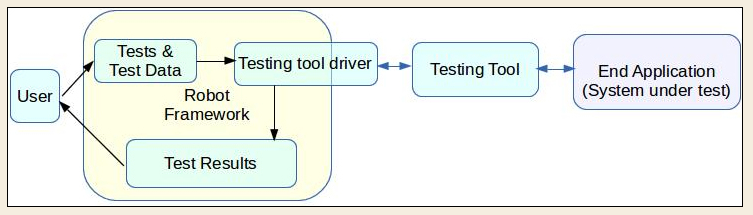

# Robot framework 

The Robot Framework is an open source, general purpose test automation framework used for acceptance testing and streamlines it into mainstream development, giving rise to the concept of acceptance test driven development (ATDD). **Python-based, keyword-driven, and acceptance test automation framework.** 



## Example usage 

./tests/TC01.robot: (*notice 2 spaces, double space, around key word **log***)

```
*** Settings ***
Documentation     A test suite with a single test for example.

***Test Cases***

First Test Action  log  this is a basic test

```

`python -m robot.run tests/`

```
(v) mstan@vitredzmj:~/projects/py-playground/robotframe/simpleapp$ python -m robot.run tests/
==============================================================================
Tests                                                                         
==============================================================================
Tests.TC01                                                                    
==============================================================================
First Test Action                                                     | PASS |
------------------------------------------------------------------------------
Tests.TC01                                                            | PASS |
1 critical test, 1 passed, 0 failed
1 test total, 1 passed, 0 failed
==============================================================================
Tests                                                                 | PASS |
1 critical test, 1 passed, 0 failed
1 test total, 1 passed, 0 failed
==============================================================================
Output:  /home/mstan/projects/py-playground/robotframe/simpleapp/output.xml
Log:     /home/mstan/projects/py-playground/robotframe/simpleapp/log.html
Report:  /home/mstan/projects/py-playground/robotframe/simpleapp/report.html
```

## Test config files 

### 1) Suite initialization files

`__init__.robot`

### 2) External variable files

`${Variable Name}` - single-valued variables

`@{Variable Name}` - variable containing a list of different values

```
*** Variables *** 
${Weather}  London  Cloudy  25 
${humidity}  75 
${MARKS}  65.5 
@{DAYS}  Monday  Wednesday  Friday  Sunday
```

#### Python file containing variables 

`person = { 'name' : 'John Doe','age' : '26', 'grade' : 'A', 'gpa' : 8.9 }`

```
*** Setting ***
Variables  python_file.py
...
*** Test Cases ***
...
  Log  For ${person['name']}, the grade obtained was ${person['grade']}
```

### 3) Resource files


